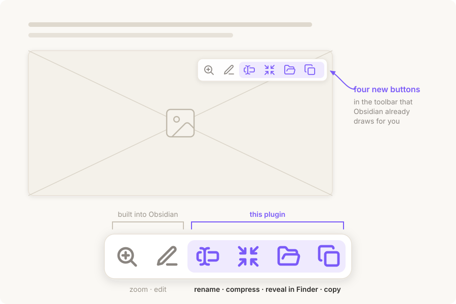

# Image Copy & Reveal

Rename an image after its note, shrink it to WebP, reveal it in Finder or Explorer, or copy it to the clipboard — without leaving Obsidian and without the right-click menu.

Unlike other image plugins, this one does not draw a toolbar of its own. It adds its buttons to the **built-in** hover toolbar that Obsidian itself shows in the top-right corner of an embedded image, next to the native zoom and edit buttons:

| Button | What it does |
| --- | --- |
| Rename after this note | Renames the image to match the note it is embedded in, numbering repeats automatically |
| Convert to WebP | Re-encodes the image as WebP, typically to under a tenth of its size, and sends the original to the system trash |
| Reveal in file explorer | Opens the containing folder and selects the file (Finder on macOS, Explorer on Windows) |
| Copy image | Puts the image itself on the system clipboard, so it can be pasted into any other app |

Every action is also a command, so it can be bound to a hotkey and fired while hovering over an image. Labels follow the Obsidian interface language (English and Chinese are included).

## WebP conversion

Conversion runs through the WebP encoder Chromium already ships with, so there is nothing to install and no binary bundled with the plugin. On a 1918×820 PNG screenshot, measured end to end:

| | Size | Of original |
| --- | --- | --- |
| Source PNG | 1301 KB | 100% |
| WebP, quality 95 | 159 KB | 12% |
| **WebP, quality 90 (default)** | **109 KB** | **8%** |
| WebP, quality 85 | 88 KB | 7% |

This is lossy. Pixels change, and the trade is deliberate: screenshots and diagrams survive quality 90 without visible damage while shedding more than 90% of their weight. Photographs with fine gradients deserve a higher setting. Quality is a slider in the plugin's settings; note that 100 is not worth reaching for, as it lands near 89% of the original size.

Because the extension changes, every note embedding the image is updated through Obsidian's own rename machinery, so links follow the file. The original always goes to the **system trash**, never straight to deletion. Files that are already WebP are refused rather than re-encoded, which would only shed more detail, and anything that would not actually get smaller is left alone.

## What copying puts on the clipboard

The system clipboard carries decoded pixels, not a file's own bytes. A 109 KB WebP therefore arrives at the far end as a full-size bitmap, and no choice of format changes that — copying a compressed JPEG behaves exactly the same way. Compression is worth doing for what it does to the vault on disk and in sync, not for what it does to a paste.

So the copy button offers two things at once where the platform allows it: the bitmap, for anything that takes an image, and on macOS a reference to the file itself, for anything that takes a file — Finder, mail, chat apps — which then receive the compressed original. Whether both can sit on the clipboard together is up to the platform, so the plugin checks afterwards and keeps the bitmap if the file reference displaced it.

WebP cannot be read by Electron's `nativeImage`, so those images are repainted through a canvas to produce the bitmap. PNG and JPEG are handed over directly.

## Renaming

The first image takes the note's own name; later ones get `-1`, `-2` and so on, and the counter skips over names that are already taken. Links are updated through Obsidian's own rename machinery, so every note that points at the image follows along.

## Requirements

- Obsidian 1.13.0 or later (the hover toolbar this plugin extends is built in from that version)
- Desktop only — the clipboard and file-explorer integrations use Electron APIs that do not exist on mobile

## Installation

### From the community plugin store

Settings → Community plugins → Browse → search for "Image Copy & Reveal" → Install → Enable.

### Manual

1. Download `main.js` and `manifest.json` from the [latest release](../../releases/latest).
2. Put them in `<vault>/.obsidian/plugins/image-copy-reveal/`.
3. Reload Obsidian and enable the plugin under Settings → Community plugins.

## How it works

Obsidian renders its own action toolbar as `.embed-actions` inside `.image-embed`. The plugin watches for that element and appends its two buttons to it, so they sit alongside the built-in zoom and edit buttons and inherit their styling.

The image file is located from the `app://` URL on the rendered ``, falling back to resolving the embed's link target through the metadata cache.

That toolbar is an internal part of Obsidian rather than a public API, so a future redesign of it could stop the buttons from appearing. Nothing else breaks if that happens, and the two commands keep working. Toolbars inside hover popovers are not covered, because the plugin only watches the workspace container.

## License

MIT — see [LICENSE](LICENSE).
