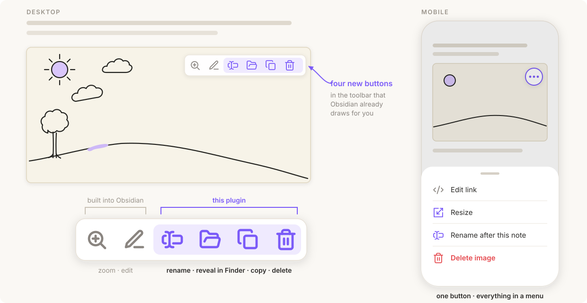

# Image Copy and Reveal

Resize, rename or delete an image, and on desktop reveal it in Finder or Explorer or copy it to the clipboard — without leaving Obsidian and without the right-click menu. Works on mobile too.

Unlike other image plugins, this one does not draw a toolbar of its own. It adds its buttons to the **built-in** hover toolbar that Obsidian itself shows in the top-right corner of an embedded image, next to the native zoom and edit buttons:

| Button | What it does |
| --- | --- |
| Rename after this note | Renames the image to match the note it is embedded in, numbering repeats automatically |
| Reveal in file explorer | Opens the containing folder and selects the file (Finder on macOS, Explorer on Windows) |
| Copy image | Puts the image itself on the system clipboard, so it can be pasted into any other app |
| Delete image | Removes the image from the note, and deletes the file too when nothing else in the vault uses it |

Every action is also a command, so it can be bound to a hotkey and fired while hovering over an image. Labels follow the Obsidian interface language (English and Chinese are included).

## On mobile

Tapping an image selects it and shows the same toolbar. A phone has room for one button there, so the plugin leaves a single **⋯** button, and everything goes into the menu it opens, Obsidian's own edit button included:

- **Edit link** — Obsidian's own edit button, moved into the menu
- **Resize** — opens a slider, with 25% / 50% / 75% / 100% and Original. Obsidian draws its drag handle on desktop only, so this stands in for it. Dragging repaints the image; the note changes once, when you let go, so one undo reverts it
- **Rename after this note**
- **Delete image**

Revealing and copying use the desktop app's file and clipboard access, so they are desktop only.

Widths are written into the link the same way the desktop handle writes them (`![[image.png|300]]`), and that syntax only knows pixels. A width chosen on a phone therefore looks smaller on a wide desktop window, and a desktop width is capped at the screen width on a phone.

## Deleting

The link is removed from the note first; that is an ordinary edit, so undo brings it back. Then the plugin counts every other place that uses the same file:

- other links in the same note, read from the editor so the last few keystrokes count
- other notes, from Obsidian's link index
- other notes open in an editor, in case the index has not caught up with them yet
- canvases

If anything else uses it, the file stays and a notice says how many places still do. If nothing does, the file is deleted through Obsidian itself, so your **Confirm file deletion** and **Deleted files** settings (system trash, the vault's `.trash` folder, or permanent) decide what happens. When in doubt the count leans towards "still used": an extra file is cheap, a missing one is not.

## Shrinking images

Compression lives in its own plugin now. [Photo Slimmer](https://github.com/RainaJIA716/obsidian-photo-slimmer) shrinks oversized images automatically as soon as they land in the vault, on mobile as well as desktop, and keeps the file name and extension unchanged so links never move. This plugin stays focused on the three things it does from the toolbar.

## What copying puts on the clipboard

The clipboard carries decoded pixels, not a file's bytes, so the payload has nothing to do with the size on disk — a 0.67 MB image can land on the clipboard as 4.75 MB of PNG, because canvas encodes quickly rather than tightly. That buffer lives until the next copy; it is never stored and never synced.

Handing the clipboard a reference to the file instead would make a paste land as the file itself. It is not worth it: on macOS the two cannot coexist — writing a custom pasteboard type clears the pasteboard first — so buying that would mean giving up the bitmap, and with it every target that takes an image but not a file. The plugin therefore writes the bitmap and nothing else. When a target genuinely needs the file, the reveal button puts it in Finder ready to drag.

WebP cannot be read by Electron's `nativeImage`, so those images are repainted through a canvas to produce the bitmap. PNG and JPEG are handed over directly.

## Renaming

The first image takes the note's own name; later ones get `-1`, `-2` and so on, and the counter skips over names that are already taken. Links are updated through Obsidian's own rename machinery, so every note that points at the image follows along.

## Requirements

- Obsidian 1.13.0 or later (the hover toolbar this plugin extends is built in from that version)
- Desktop and mobile. Copying and revealing are desktop only, because they use Electron APIs that do not exist on mobile

## Installation

### From the community plugin store

Settings → Community plugins → Browse → search for "Image Copy and Reveal" → Install → Enable.

### Manual

1. Download `main.js`, `manifest.json` and `styles.css` from the [latest release](../../releases/latest).
2. Put them in `<vault>/.obsidian/plugins/image-copy-reveal/`.
3. Reload Obsidian and enable the plugin under Settings → Community plugins.

## How it works

Obsidian renders its own action toolbar as `.embed-actions` inside `.image-embed`. The plugin watches for that element and appends its buttons to it, so they sit alongside the built-in zoom and edit buttons and inherit their styling.

The image file is located from the `app://` URL on the rendered ``, falling back to resolving the embed's link target through the metadata cache.

Resizing and deleting work on the note's text: the plugin finds the embed whose link points at the same file, nearest to where the image is drawn, and edits only that. These two need Live Preview, which is where the toolbar appears.

That toolbar is an internal part of Obsidian rather than a public API, so a future redesign of it could stop the buttons from appearing. Nothing else breaks if that happens, and the commands keep working. Toolbars inside hover popovers are not covered, because the plugin only watches the workspace container.

## License

MIT — see [LICENSE](LICENSE).
